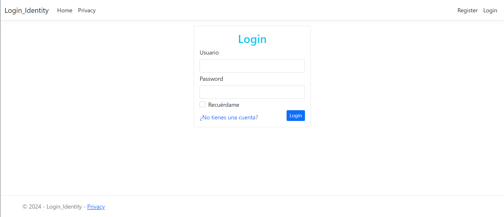
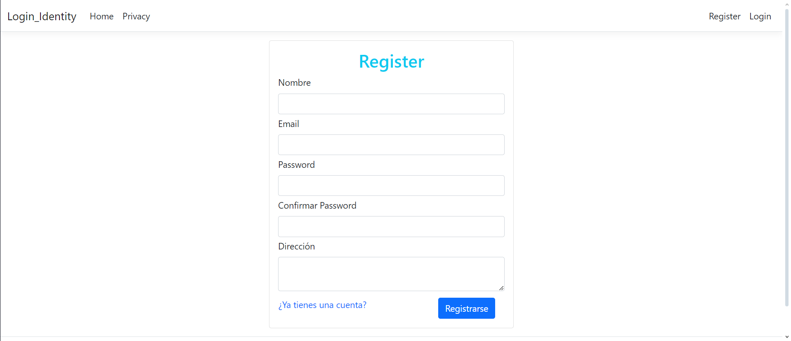

# Implementación Personalizada de ASP.NET Core Identity en ASP.NET Core MVC

Este proyecto utiliza ASP.NET Core Identity, una API que facilita la funcionalidad de inicio de sesión en la interfaz de usuario (UI). 
ASP.NET Core Identity gestiona usuarios, contraseñas, datos de perfil, roles, reclamaciones (claims), tokens, confirmación de correo electrónico y mucho más.

## Características Implementadas
1. Controlador de Cuenta Personalizado: Hemos creado un controlador de cuenta personalizado con métodos propios para las siguientes funcionalidades:

- Inicio de sesión de usuarios.
- Registro de nuevos usuarios.
- Cierre de sesión de usuarios.
  
2. Vistas Personalizadas: Además de los métodos personalizados, también hemos desarrollado nuestras propias vistas para manejar el inicio de sesión, registro y cierre de sesión, brindando una experiencia de usuario coherente con el diseño de la aplicación.

### Tecnologías utilizadas:
 1. Identity.EntityFrameworkCore
 2. .NET 7
 3. Microsoft SQL Server
 4. Entity Framework Core
 5. Bootstrap
 6. ASP.NET Core MVC

